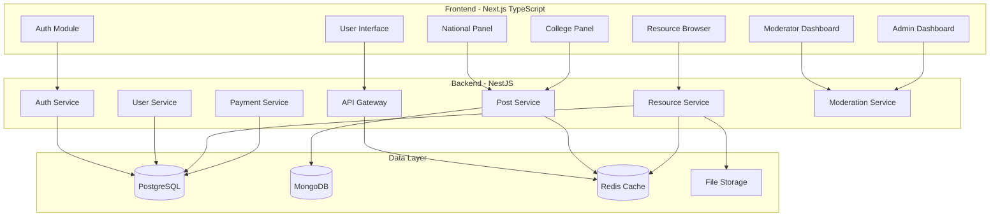

# Design Document: Critical Thinking Network (CTN)

## Overview

The Critical Thinking Network is a full-stack social media platform built with Next.js (TypeScript) frontend, NestJS backend, and a multi-database architecture. The platform serves three primary functions:

1. **National Critical Discourse**: A public discussion forum for intellectual debate
2. **College-Specific Discussions**: Private, verified campus communities
3. **Academic Resource System**: A hierarchical repository with paid cross-college access

The system implements role-based access control with five distinct user roles (Guest, General_User, College_User, Moderator, Admin) and uses three databases (PostgreSQL for relational data, MongoDB for activity feeds, Redis for caching) to optimize performance and data organization.

## Architecture

### System Architecture



### Database Schema Design

**PostgreSQL Schema (Relational Data)**

```typescript
// Users and Authentication
User {
  id: UUID
  email: string
  username: string (unique)
  displayName?: string
  passwordHash: string
  role: enum('GUEST', 'GENERAL_USER', 'COLLEGE_USER', 'MODERATOR', 'ADMIN')
  collegeId?: UUID
  bio?: string
  profilePictureUrl?: string
  createdAt: timestamp
  updatedAt: timestamp
}

UserProfile {
  userId: UUID
  postCount: number
  commentCount: number
  likesReceived: number
  lastActive: timestamp
}

College {
  id: UUID
  name: string
  emailDomain: string
  logoUrl: string
  createdAt: timestamp
}

// Academic Resources
Resource {
  id: UUID
  collegeId: UUID
  resourceType: enum('TOPPER_NOTES', 'PYQS', 'CASE_DECKS', 'PRESENTATIONS', 'STRATEGIES')
  department: string
  batch: string
  fileName: string
  fileUrl: string
  uploadedBy: UUID
  description: string
  uploadDate: timestamp
}

ResourceAccess {
  id: UUID
  userId: UUID
  resourceId: UUID
  accessType: enum('OWN_COLLEGE', 'PAID')
  paymentAmount?: decimal
  unlockedAt: timestamp
}

// Relationships
Moderator {
  id: UUID
  userId: UUID
  collegeId: UUID
  assignedAt: timestamp
  assignedBy: UUID
}
```

**MongoDB Schema (Activity Data)**

```typescript
// National and College Posts
Post {
  _id: ObjectId
  authorId: string  // UUID reference
  authorName: string
  authorRole: string
  collegeId?: string  // UUID reference (for college posts)
  panelType: 'NATIONAL' | 'COLLEGE'
  title: string
  content: string
  likes: number
  commentCount: number
  reportCount: number
  createdAt: Date
  updatedAt: Date
}

Comment {
  _id: ObjectId
  postId: ObjectId
  authorId: string
  authorName: string
  content: string
  likes: number
  parentCommentId?: ObjectId  // for threading
  createdAt: Date
}

Like {
  _id: ObjectId
  targetId: ObjectId  // post or comment
  targetType: 'POST' | 'COMMENT'
  userId: string
  createdAt: Date
}

Report {
  _id: ObjectId
  targetId: ObjectId
  targetType: 'POST' | 'COMMENT'
  reportedBy: string
  reason: string
  status: 'PENDING' | 'REVIEWED' | 'RESOLVED'
  createdAt: Date
}
```

**Redis Cache Structure**

```typescript
// Cache Keys
"user:session:{userId}" -> User session data
"college:resources:{collegeId}" -> Resource tree structure
"post:feed:national:{page}" -> Paginated national feed
"post:feed:college:{collegeId}:{page}" -> Paginated college feed
"user:unlocks:{userId}" -> Set of unlocked resource IDs
```

## Components and Interfaces

### Frontend Components

**Authentication Module**
```typescript
interface AuthContext {
  user: User | null
  role: UserRole
  college: College | null
  login: (email: string, password: string) => Promise<void>
  logout: () => void
  isAuthenticated: boolean
}

interface User {
  id: string
  email: string
  username: string
  displayName?: string
  role: UserRole
  collegeId?: string
  profilePictureUrl?: string
  bio?: string
  createdAt: Date
}

enum UserRole {
  GUEST = 'GUEST',
  GENERAL_USER = 'GENERAL_USER',
  COLLEGE_USER = 'COLLEGE_USER',
  MODERATOR = 'MODERATOR',
  ADMIN = 'ADMIN'
}
```

**National Discussion Panel**
```typescript
interface NationalPanelProps {
  userRole: UserRole
}

interface Post {
  id: string
  author: {
    id: string
    name: string
    role: UserRole
  }
  title: string
  content: string
  likes: number
  commentCount: number
  createdAt: Date
  isLiked: boolean
}

interface PostActions {
  createPost: (title: string, content: string) => Promise<Post>
  likePost: (postId: string) => Promise<void>
  commentOnPost: (postId: string, content: string) => Promise<Comment>
  reportPost: (postId: string, reason: string) => Promise<void>
}
```

**College Discussion Panel**
```typescript
interface CollegePanelProps {
  collegeId: string
  collegeName: string
  logoUrl: string
}

interface CollegePost extends Post {
  collegeId: string
}
```

**Resource Browser**
```typescript
interface ResourceBrowserProps {
  defaultCollegeId: string
  userRole: UserRole
}

interface ResourceHierarchy {
  college: College
  resourceTypes: ResourceType[]
}

interface ResourceType {
  type: 'TOPPER_NOTES' | 'PYQS' | 'CASE_DECKS' | 'PRESENTATIONS' | 'STRATEGIES'
  departments: Department[]
}

interface Department {
  name: string
  batches: Batch[]
}

interface Batch {
  name: string
  files: ResourceFile[]
}

interface ResourceFile {
  id: string
  name: string
  uploadedBy: string
  batch: string
  description: string
  uploadDate: Date
  isLocked: boolean
  isUnlocked: boolean
}

interface ResourceActions {
  browseCollege: (collegeId: string) => Promise<ResourceHierarchy>
  viewFile: (fileId: string) => Promise<void>  // May trigger payment
  downloadFile: (fileId: string) => Promise<void>  // May trigger payment
  unlockFile: (fileId: string, paymentToken: string) => Promise<void>
}
```

**Moderator Dashboard**
```typescript
interface ModeratorDashboardProps {
  collegeId: string
}

interface ModeratorActions {
  uploadResource: (
    resourceType: string,
    department: string,
    batch: string,
    file: File,
    description: string
  ) => Promise<Resource>
  organizeResource: (resourceId: string, newPath: ResourcePath) => Promise<void>
  flagContent: (contentId: string, contentType: string, reason: string) => Promise<void>
}

interface ResourcePath {
  resourceType: string
  department: string
  batch: string
}
```

**Admin Dashboard**
```typescript
interface AdminDashboardProps {
  // Full platform access
}

interface AdminActions {
  // College Management
  createCollege: (name: string, emailDomain: string, logoUrl: string) => Promise<College>
  deleteCollege: (collegeId: string) => Promise<void>
  approveEmailDomain: (domain: string) => Promise<void>
  
  // User Management
  assignModerator: (userId: string, collegeId: string) => Promise<void>
  revokeModerator: (userId: string) => Promise<void>
  
  // Content Management
  deletePost: (postId: string, panelType: string) => Promise<void>
  deleteResource: (resourceId: string) => Promise<void>
  
  // Payment Management
  viewPaymentRecords: () => Promise<PaymentRecord[]>
  viewUnlockRecords: () => Promise<UnlockRecord[]>
}
```

**User Profile Component**
```typescript
interface UserProfileProps {
  userId: string
  isOwnProfile: boolean
}

interface UserProfileData {
  username: string
  displayName?: string
  email?: string  // Only visible to own profile
  role: UserRole
  college?: College
  bio?: string
  profilePictureUrl?: string
  joinDate: Date
  stats: {
    postCount: number
    commentCount: number
    likesReceived: number
  }
}

interface ProfileActions {
  updateProfile: (data: ProfileUpdateData) => Promise<void>
  uploadProfilePicture: (file: File) => Promise<string>
}

interface ProfileUpdateData {
  displayName?: string
  bio?: string
  profilePictureUrl?: string
}
```

**User Search Component**
```typescript
interface UserSearchProps {
  userRole: UserRole
}

interface UserSearchResult {
  id: string
  username: string
  displayName?: string
  profilePictureUrl?: string
  role: UserRole
  college?: {
    id: string
    name: string
  }
}

interface UserSearchActions {
  searchUsers: (query: string) => Promise<UserSearchResult[]>
  viewUserProfile: (userId: string) => void
}
```

### Backend Services

**Authentication Service**
```typescript
interface AuthService {
  register(email: string, username: string, password: string): Promise<User>
  login(email: string, password: string): Promise<{ user: User, token: string }>
  verifyCollegeEmail(email: string): Promise<College | null>
  assignRole(userId: string, role: UserRole): Promise<void>
  checkUsernameAvailability(username: string): Promise<boolean>
}
```

**User Service**
```typescript
interface UserService {
  // Profile Management
  getUserProfile(userId: string): Promise<UserProfileData>
  updateUserProfile(userId: string, data: ProfileUpdateData): Promise<User>
  uploadProfilePicture(userId: string, file: Buffer): Promise<string>
  
  // User Search
  searchUsers(query: string, limit: number): Promise<UserSearchResult[]>
  
  // Statistics
  getUserStats(userId: string): Promise<UserStats>
  incrementPostCount(userId: string): Promise<void>
  incrementCommentCount(userId: string): Promise<void>
}

interface UserStats {
  postCount: number
  commentCount: number
  likesReceived: number
}
```

**Post Service**
```typescript
interface PostService {
  // National Panel
  createNationalPost(userId: string, title: string, content: string): Promise<Post>
  getNationalFeed(page: number, limit: number): Promise<Post[]>
  
  // College Panel
  createCollegePost(userId: string, collegeId: string, title: string, content: string): Promise<Post>
  getCollegeFeed(collegeId: string, page: number, limit: number): Promise<Post[]>
  
  // Interactions
  likePost(userId: string, postId: string): Promise<void>
  commentOnPost(userId: string, postId: string, content: string): Promise<Comment>
  reportPost(userId: string, postId: string, reason: string): Promise<void>
  
  // Access Control
  canAccessCollegePost(userId: string, postId: string): Promise<boolean>
}
```

**Resource Service**
```typescript
interface ResourceService {
  // Browsing
  getResourceHierarchy(collegeId: string, userId: string): Promise<ResourceHierarchy>
  getResourceFile(fileId: string, userId: string): Promise<ResourceFile>
  
  // Access Control
  canAccessResource(userId: string, resourceId: string): Promise<AccessResult>
  unlockResource(userId: string, resourceId: string, paymentToken: string): Promise<void>
  
  // Upload (Moderator)
  uploadResource(
    moderatorId: string,
    collegeId: string,
    resourceType: string,
    department: string,
    batch: string,
    file: Buffer,
    metadata: ResourceMetadata
  ): Promise<Resource>
  
  // Management (Admin)
  deleteResource(adminId: string, resourceId: string): Promise<void>
}

interface AccessResult {
  canAccess: boolean
  requiresPayment: boolean
  isUnlocked: boolean
}
```

**Payment Service**
```typescript
interface PaymentService {
  initiatePayment(userId: string, resourceId: string): Promise<PaymentSession>
  verifyPayment(paymentToken: string): Promise<PaymentResult>
  recordUnlock(userId: string, resourceId: string, amount: number): Promise<void>
  getUserUnlocks(userId: string): Promise<ResourceAccess[]>
}
```

## Data Models

### User and Role Model

The system uses a role-based access control (RBAC) model with five distinct roles:

1. **GUEST**: Unauthenticated users (read-only national panel)
2. **GENERAL_USER**: Authenticated with normal email (national panel interaction)
3. **COLLEGE_USER**: Authenticated with college email (national + college panel + resources)
4. **MODERATOR**: Campus ambassador (resource management for their college)
5. **ADMIN**: Super administrator (full platform control)

Role assignment logic:
- No login → GUEST
- Normal email login → GENERAL_USER
- College email login → COLLEGE_USER (after domain verification)
- COLLEGE_USER + admin assignment → MODERATOR
- Platform owner → ADMIN

### Resource Hierarchy Model

The resource system follows a strict 5-level hierarchy:

```
Level 1: College (e.g., "IIM Jammu")
  └─ Level 2: Resource Type (e.g., "Topper Notes")
      └─ Level 3: Department (e.g., "MBA")
          └─ Level 4: Batch (e.g., "2021 Batch")
              └─ Level 5: Files (e.g., "Marketing_Notes.pdf")
```

Each level is represented in the database and enforced through application logic.

### Access Control Model

**National Panel Access Matrix:**
| Role | View | Post | Comment | Like | Report |
|------|------|------|---------|------|--------|
| GUEST | ✓ | ✗ | ✗ | ✗ | ✗ |
| GENERAL_USER | ✓ | ✓ | ✓ | ✓ | ✓ |
| COLLEGE_USER | ✓ | ✓ | ✓ | ✓ | ✓ |
| MODERATOR | ✓ | ✓ | ✓ | ✓ | ✓ |
| ADMIN | ✓ | ✓ | ✓ | ✓ | ✓ |

**College Panel Access Matrix:**
| Role | View | Post | Comment | Like |
|------|------|------|---------|------|
| GUEST | ✗ | ✗ | ✗ | ✗ |
| GENERAL_USER | ✗ | ✗ | ✗ | ✗ |
| COLLEGE_USER | ✓ (own) | ✓ (own) | ✓ (own) | ✓ (own) |
| MODERATOR | ✓ (own) | ✓ (own) | ✓ (own) | ✓ (own) |
| ADMIN | ✓ (all) | ✓ (all) | ✓ (all) | ✓ (all) |

**Resource Access Matrix:**
| Role | Browse Own | Download Own | Browse Other | Download Other |
|------|------------|--------------|--------------|----------------|
| GUEST | ✗ | ✗ | ✗ | ✗ |
| GENERAL_USER | ✗ | ✗ | ✗ | ✗ |
| COLLEGE_USER | ✓ | ✓ (free) | ✓ (preview) | ✓ (paid) |
| MODERATOR | ✓ | ✓ (free) | ✓ (preview) | ✓ (paid) |
| ADMIN | ✓ (all) | ✓ (all, free) | ✓ (all) | ✓ (all, free) |


## Correctness Properties

*A property is a characteristic or behavior that should hold true across all valid executions of a system—essentially, a formal statement about what the system should do. Properties serve as the bridge between human-readable specifications and machine-verifiable correctness guarantees.*

### Authentication and Role Management Properties

**Property 1: Normal email registration creates general users**
*For any* valid normal email address (Gmail, Outlook, Yahoo, etc.), registration should create a user account with GENERAL_USER role and grant access to the National_Panel.
**Validates: Requirements 1.2**

**Property 2: College email domain verification**
*For any* email address, the system should correctly identify whether its domain exists in the approved college domains registry.
**Validates: Requirements 1.3**

**Property 3: College email registration creates college users**
*For any* verified college email address, registration should create a user account with COLLEGE_USER role and correctly map the user to their college based on the email domain.
**Validates: Requirements 1.4**

**Property 4: Role assignment consistency**
*For any* user account, login should return the role that matches the user's email type and verification status (normal email → GENERAL_USER, verified college email → COLLEGE_USER).
**Validates: Requirements 1.5**

**Property 5: Domain registry persistence**
*For any* college email domain, adding it to the registry should make it available for verification, and removing it should prevent future verifications using that domain.
**Validates: Requirements 1.6**

### National Discussion Panel Properties

**Property 6: Guest interaction prevention**
*For any* guest user (unauthenticated), attempts to post, comment, or like on the National_Panel should return authorization errors.
**Validates: Requirements 2.2**

**Property 7: Post creation validation**
*For any* post creation attempt by an authenticated user, missing title or content should result in a validation error.
**Validates: Requirements 2.3**

**Property 8: Author identity preservation**
*For any* created post, the author information should be present and match the authenticated user who created it (no anonymous posting).
**Validates: Requirements 2.4**

**Property 9: Comment threading and like counts**
*For any* post with comments, the response should include proper comment threading structure and accurate like counts for both the post and its comments.
**Validates: Requirements 2.5**

**Property 10: Authenticated user interaction access**
*For any* logged-in user with role GENERAL_USER or COLLEGE_USER, posting, commenting, and liking endpoints on the National_Panel should be accessible.
**Validates: Requirements 2.6**

**Property 11: Report creation**
*For any* report submission on a post or comment, a report record should be created with PENDING status and flagged for moderator review.
**Validates: Requirements 2.7**

### College Discussion Panel Properties

**Property 12: Non-college user access denial**
*For any* user with role GUEST or GENERAL_USER, attempts to access any College_Panel endpoint should return authorization errors.
**Validates: Requirements 3.2**

**Property 13: College post filtering**
*For any* college user viewing their College_Panel feed, all returned posts should belong to users from the same college.
**Validates: Requirements 3.3**

**Property 14: College post isolation**
*For any* post created in a College_Panel, only users from that specific college should be able to retrieve or view it; users from other colleges should receive authorization errors.
**Validates: Requirements 3.4, 3.5**

**Property 15: College branding inclusion**
*For any* College_Panel response, it should include the college's logo URL and name.
**Validates: Requirements 3.6**

**Property 16: College user interaction access**
*For any* college user accessing their own College_Panel, posting, commenting, and liking endpoints should be accessible.
**Validates: Requirements 3.7**

### Resource System Structure Properties

**Property 17: Five-level hierarchy completeness**
*For any* resource in the system, it should have all five hierarchy levels defined: College, Resource_Type, Department, Batch, and File metadata.
**Validates: Requirements 4.1**

**Property 18: Resource type validation**
*For any* resource creation or update, the system should accept only valid Resource_Type values (TOPPER_NOTES, PYQS, CASE_DECKS, PRESENTATIONS, STRATEGIES) and reject invalid types.
**Validates: Requirements 4.3**

**Property 19: Department organization**
*For any* college's resource hierarchy, departments should be properly organized and accessible when browsing resources.
**Validates: Requirements 4.4**

**Property 20: Batch organization**
*For any* department in the resource hierarchy, batch folders should be properly organized and accessible when navigating the hierarchy.
**Validates: Requirements 4.5**

**Property 21: File metadata completeness**
*For any* file in the resource system, all required metadata fields should be present: uploadedBy, batch, description, and uploadDate.
**Validates: Requirements 4.6**

### Own College Resource Access Properties

**Property 22: Own college folder access**
*For any* college user, all folders in their own college's resource hierarchy should be accessible without restrictions.
**Validates: Requirements 5.1**

**Property 23: Own college file access without payment**
*For any* file from a user's own college, viewing and downloading should be allowed without payment checks or restrictions.
**Validates: Requirements 5.2, 5.3**

**Property 24: General user resource denial**
*For any* user with role GENERAL_USER, attempts to access Resource_System endpoints should return authorization errors.
**Validates: Requirements 5.4**

**Property 25: Own college access tracking**
*For any* resource access by a college user to their own college's files, an access record should be created without payment data.
**Validates: Requirements 5.5**

### Cross-College Resource Access Properties

**Property 26: Cross-college hierarchy browsing**
*For any* college selection by a college user, the system should return that college's complete resource hierarchy (Resource_Types, Departments, Batches).
**Validates: Requirements 6.2**

**Property 27: Cross-college folder visibility**
*For any* college user browsing another college's resources, Resource_Type, Department, and Batch folders should be visible without payment requirements.
**Validates: Requirements 6.3**

**Property 28: Cross-college file preview**
*For any* file from another college, metadata (name, uploadedBy, description, uploadDate) should be visible, but the file content should be locked.
**Validates: Requirements 6.4**

**Property 29: Locked file access prevention**
*For any* unpaid file from another college, attempts to view or download should be blocked and indicate that payment is required.
**Validates: Requirements 6.5, 6.6**

**Property 30: Payment unlocks file access**
*For any* file from another college, after successful payment completion, viewing and downloading should be granted for that specific file.
**Validates: Requirements 6.7**

**Property 31: Unlock record persistence**
*For any* successful payment for a resource, an unlock record should be created and persisted with the userId, resourceId, payment amount, and timestamp.
**Validates: Requirements 6.8**

**Property 32: Payment does not grant college panel access**
*For any* college panel, payment for resources should not grant access to that college's discussion panel; cross-college panel access should remain blocked.
**Validates: Requirements 6.9**

### Moderator Permission Properties

**Property 33: Resource upload validation**
*For any* resource upload by a moderator, missing Resource_Type, Department, or Batch should result in validation errors.
**Validates: Requirements 7.2**

**Property 34: Resource hierarchical placement**
*For any* resource uploaded by a moderator, it should appear in the correct hierarchical path (College → Resource_Type → Department → Batch) for their assigned college.
**Validates: Requirements 7.3**

**Property 35: Moderator college restriction**
*For any* moderator, attempts to manage resources or content for colleges other than their assigned college should return authorization errors.
**Validates: Requirements 7.5, 7.6**

**Property 36: Moderator permission boundaries**
*For any* moderator, attempts to access admin-level endpoints (role assignment, college management, platform-wide moderation) should return authorization errors.
**Validates: Requirements 7.7**

### Admin Permission Properties

**Property 37: Admin cross-panel post management**
*For any* admin, post creation and deletion endpoints should be accessible for all panels (National and all College_Panels).
**Validates: Requirements 8.2**

**Property 38: Admin cross-college resource management**
*For any* admin, resource creation and deletion endpoints should be accessible for all colleges.
**Validates: Requirements 8.3**

**Property 39: College creation workflow**
*For any* new college created by an admin, the college entity should be created with the specified name, email domain, and logo, and the domain should be added to the verification registry.
**Validates: Requirements 8.4**

**Property 40: Domain approval workflow**
*For any* college email domain approved by an admin, it should be added to the verification registry and become available for user registration verification.
**Validates: Requirements 8.5**

**Property 41: Moderator role management**
*For any* user, an admin should be able to assign the MODERATOR role with a college assignment, and revoke the MODERATOR role, with changes reflected immediately.
**Validates: Requirements 8.6**

**Property 42: Admin platform-wide moderation**
*For any* admin, content moderation endpoints should be accessible for all modules (National_Panel, all College_Panels, Resource_System).
**Validates: Requirements 8.8**

### Navigation and Profile Properties

**Property 43: Role-based navigation**
*For any* user, the available navigation options should match their authorization level (GUEST sees National only, GENERAL_USER sees National + Profile, COLLEGE_USER sees National + College + Resources).
**Validates: Requirements 9.4**

**Property 44: Profile information completeness**
*For any* user viewing their profile, the response should include their role and, if applicable, their associated college information.
**Validates: Requirements 9.5**

### Username and Profile Properties

**Property 45: Username uniqueness validation**
*For any* two users in the system, their usernames must be different; the system should reject registration attempts with duplicate usernames.
**Validates: Requirements 11.2, 11.3**

**Property 46: Username character validation**
*For any* username, it should only be accepted if it contains alphanumeric characters, underscores, or hyphens; usernames with other characters should be rejected.
**Validates: Requirements 11.4**

**Property 47: Username length validation**
*For any* username, it should only be accepted if its length is between 3 and 30 characters (inclusive); usernames outside this range should be rejected.
**Validates: Requirements 11.5**

**Property 48: Own profile data completeness**
*For any* user viewing their own profile, the response should include username, email, role, college (if applicable), join date, and activity statistics (post count, comment count, likes received).
**Validates: Requirements 11.6**

**Property 49: Public profile data visibility**
*For any* user viewing another user's profile, the response should include only public information (username, display name, role, college, join date, post count) and should not include private information (email).
**Validates: Requirements 11.7**

**Property 50: Profile update persistence**
*For any* user updating their profile (bio, profile picture, display name), the changes should be persisted and reflected in subsequent profile retrievals.
**Validates: Requirements 11.8**

**Property 51: Username display in content**
*For any* post or comment, the response should include the author's username alongside the content.
**Validates: Requirements 11.9**

### User Search Properties

**Property 52: Search access control**
*For any* logged-in user (GENERAL_USER, COLLEGE_USER, MODERATOR, ADMIN), the user search endpoint should be accessible; for guest users, it should return authorization errors.
**Validates: Requirements 12.1, 12.7**

**Property 53: Multi-field search**
*For any* search query, the results should include users whose username, display name, or college name contains the query string (case-insensitive).
**Validates: Requirements 12.2**

**Property 54: Search result data completeness**
*For any* user in the search results, the response should include username, display name, profile picture URL, role, and college information (if applicable).
**Validates: Requirements 12.3**

**Property 55: Search result relevance ordering**
*For any* search query, results should be ordered with exact matches appearing before partial matches.
**Validates: Requirements 12.4**

**Property 56: Search result limit**
*For any* search query, the number of returned results should not exceed 50 users.
**Validates: Requirements 12.6**

## Error Handling

### Authentication Errors
- **Invalid credentials**: Return 401 Unauthorized with clear error message
- **Unverified college email**: Return 403 Forbidden with domain verification failure message
- **Expired session**: Return 401 Unauthorized and redirect to login
- **Insufficient permissions**: Return 403 Forbidden with role requirement message

### Validation Errors
- **Missing required fields**: Return 400 Bad Request with list of missing fields
- **Invalid resource type**: Return 400 Bad Request with list of valid types
- **Invalid hierarchy path**: Return 400 Bad Request with correct path format
- **File size exceeded**: Return 413 Payload Too Large with size limit

### Access Control Errors
- **Cross-college panel access**: Return 403 Forbidden with "College panel access restricted to members"
- **Locked resource access**: Return 402 Payment Required with payment endpoint
- **Moderator cross-college action**: Return 403 Forbidden with "Action restricted to assigned college"
- **General user resource access**: Return 403 Forbidden with "Resource access requires college email"

### Payment Errors
- **Payment failed**: Return 402 Payment Required with retry endpoint
- **Already unlocked**: Return 200 OK with "Resource already unlocked" message
- **Invalid payment token**: Return 400 Bad Request with "Invalid payment token"

### Database Errors
- **Connection failure**: Return 503 Service Unavailable with retry-after header
- **Query timeout**: Return 504 Gateway Timeout
- **Duplicate entry**: Return 409 Conflict with conflicting field information

## Testing Strategy

### Dual Testing Approach

The CTN platform will use both unit testing and property-based testing to ensure comprehensive coverage:

**Unit Tests**: Verify specific examples, edge cases, and error conditions
- Specific user registration flows (Gmail, college email)
- Edge cases (empty posts, invalid resource types)
- Error conditions (unauthorized access, payment failures)
- Integration points between services

**Property Tests**: Verify universal properties across all inputs
- Role-based access control across all user types
- Resource hierarchy integrity across all colleges
- Cross-college access restrictions across all combinations
- Payment unlock workflows across all resource types

Both testing approaches are complementary and necessary. Unit tests catch concrete bugs in specific scenarios, while property tests verify general correctness across the entire input space.

### Property-Based Testing Configuration

**Framework**: We will use **fast-check** for TypeScript/JavaScript property-based testing.

**Configuration**:
- Minimum 100 iterations per property test
- Each property test must reference its design document property
- Tag format: `// Feature: critical-thinking-network, Property {number}: {property_text}`

**Example Property Test Structure**:
```typescript
import fc from 'fast-check';

// Feature: critical-thinking-network, Property 1: Normal email registration creates general users
describe('Authentication Properties', () => {
  it('should create GENERAL_USER for any valid normal email', () => {
    fc.assert(
      fc.property(
        fc.emailAddress({ domain: fc.constantFrom('gmail.com', 'outlook.com', 'yahoo.com') }),
        fc.string({ minLength: 8 }),
        async (email, password) => {
          const user = await authService.register(email, password);
          expect(user.role).toBe('GENERAL_USER');
          expect(user.email).toBe(email);
        }
      ),
      { numRuns: 100 }
    );
  });
});
```

### Test Organization

**Frontend Tests** (Next.js):
- Component unit tests using Jest + React Testing Library
- Property tests for access control logic
- Integration tests for user flows
- E2E tests using Playwright for critical paths

**Backend Tests** (NestJS):
- Service unit tests using Jest
- Property tests for business logic and access control
- Controller integration tests
- E2E API tests

**Database Tests**:
- PostgreSQL: Schema validation, referential integrity
- MongoDB: Document structure validation, query correctness
- Redis: Cache invalidation, TTL behavior

### Coverage Goals

- Unit test coverage: 80% minimum
- Property test coverage: All access control and business logic
- Integration test coverage: All API endpoints
- E2E test coverage: All critical user journeys

### Testing Priorities

**Phase 1 (MVP)**:
1. Authentication and role assignment properties
2. Access control properties (all panels and resources)
3. Resource hierarchy properties
4. Payment unlock properties
5. Critical user journey E2E tests

**Phase 2 (Post-MVP)**:
1. Performance testing (load, stress)
2. Security testing (penetration, vulnerability)
3. Chaos engineering (database failures, network issues)
4. Analytics and monitoring validation
